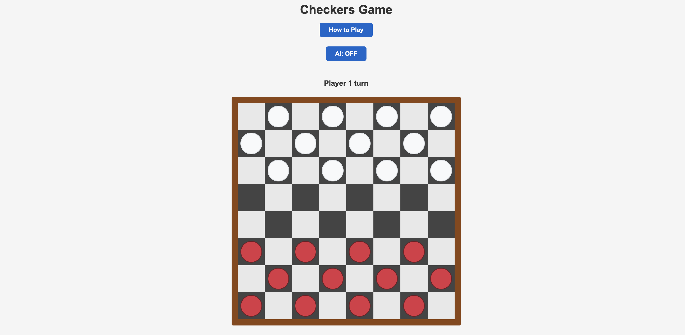

# Checkers Game



A fully functional American/English Checkers game built with vanilla JavaScript, HTML5, and CSS3. This project demonstrates clean code practices, WCAG 2.0 AA accessibility compliance, and comprehensive game logic implementation.

## 🎮 Getting Started

### Play the Game
> **Deployment Link:** https://ctrlclos.github.io/checkers-game/
### Run Locally
1. Clone this repository
2. Open `index.html` in your web browser
3. Click on a piece to select it (it will be outlined in blue)
4. Click on a highlighted square to move
5. Green squares = possible moves | Orange squares = mandatory jumps

## 📖 How to Play

### Basic Rules
- **Objective:** Capture all opponent pieces or block them from moving
- **Movement:** Pieces move diagonally forward one square on dark squares only
- **Captures:** Jump over opponent pieces to capture them
- **Kings:** Reach the opposite end of the board to promote to a King (♔)
- **King Movement:** Kings can move diagonally in any direction (forward or backward)

### Special Rules
- **Mandatory Jumps:** If a jump is available, you MUST take it
- **Multi-Jump:** If you can jump again after a capture, you must continue the sequence
- **Draw Condition:** Game ends in a draw after 40 consecutive moves without a capture
- **Win Conditions:**
  - Capture all opponent pieces, OR
  - Block opponent so they have no valid moves

## ✨ Features

### Core Gameplay
- ✅ Full 8×8 checkerboard with accurate piece placement
- ✅ Two-player turn-based gameplay (Player vs AI or Player vs Player)
- ✅ Toggle AI opponent on/off
- ✅ Piece selection with visual highlighting
- ✅ Valid move indicators (green for moves, orange for jumps)
- ✅ King promotion with crown symbol (♔)
- ✅ Jump and capture mechanics
- ✅ Mandatory jump rule enforcement
- ✅ Multi-jump (consecutive jump) sequences
- ✅ Win/loss/draw condition detection
- ✅ Game over message with play again option
- ✅ In-app "How to Play" instructions (toggleable inline section)

### Accessibility & Quality
- ✅ WCAG 2.0 AA compliant (color contrast, ARIA labels, semantic HTML)
- ✅ No distracting animations (accessibility-first design)
- ✅ Screen reader support with proper ARIA attributes
- ✅ Clean, professional UI with solid colors
- ✅ Responsive design for different screen sizes

### AI Opponent
- ✅ Computer opponent (Player 2)
- ✅ Random move selection strategy
- ✅ Automatic multi-jump continuation
- ✅ 1-second move delay for natural gameplay

## 🛠️ Technologies Used

- **HTML5** - Semantic markup with ARIA accessibility attributes
- **CSS3** - Modern styling with CSS Grid, Flexbox, and custom properties
- **Vanilla JavaScript (ES6+)** - Game logic, DOM manipulation, and event handling
- **WCAG 2.0 AA** - Accessibility compliance (color contrast, semantic HTML, ARIA)

## 📁 Project Structure

```
checkers-game/
├── index.html              # Main game interface
├── css/
│   └── style.css           # Styling and layout
├── js/
│   └── app.js              # Game logic and AI
├── screenshots/            # Project screenshots
└── README.md              # This file
```

## 🎯 Code Quality

This project follows best practices:
- Comprehensive documentation throughout codebase with clear, readable comments
- Clean, readable code with meaningful variable names
- Modular functions with single responsibilities
- No console logs in production code
- Proper error handling and user feedback
- Well-organized CSS with clear section headers

## 🚀 Next Steps (Future Enhancements)

- [ ] Add difficulty levels for AI (easy, medium, hard)
- [ ] Implement smarter AI with move evaluation
- [ ] Add sound effects and visual feedback
- [ ] Game statistics tracker (wins, losses, draws)
- [ ] Move history and undo functionality
- [ ] Save game state to local storage
- [ ] Animated piece movements
- [ ] Themes and customization options

## 📋 Attributions

This project was built using vanilla JavaScript. No external libraries or frameworks were used. All game assets (pieces, board) are rendered using HTML/CSS.

**Crown Symbol:** Unicode character U+2654 (♔)

## 📄 License

Open source - feel free to use and modify for educational purposes.

---

**Project Type:** Browser-based Game (General Assembly Project)
**Last Updated:** November 2025
